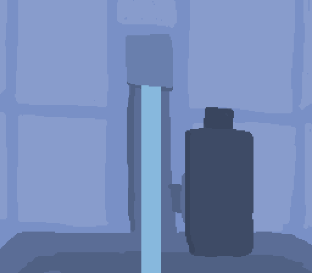

# Water Filler

Author: Jan Orlowski

Design: Use the sound of the water filling up a bottle to determine when it is full!

Screen Shot:

How To Play:

Use mouse to control bottle position. Put bottle underwater to fill it. If overfilled, the bottle is dropped. Move bottle to left or right edge of screen to give bottle. Try to get bottle as filled as possible without losing it!

Sources:

All art was made by me and all sound was recorded by me. Only exception is the text font, which was made by Jim McCann for 15-466.

This game was built with [NEST](NEST.md).
